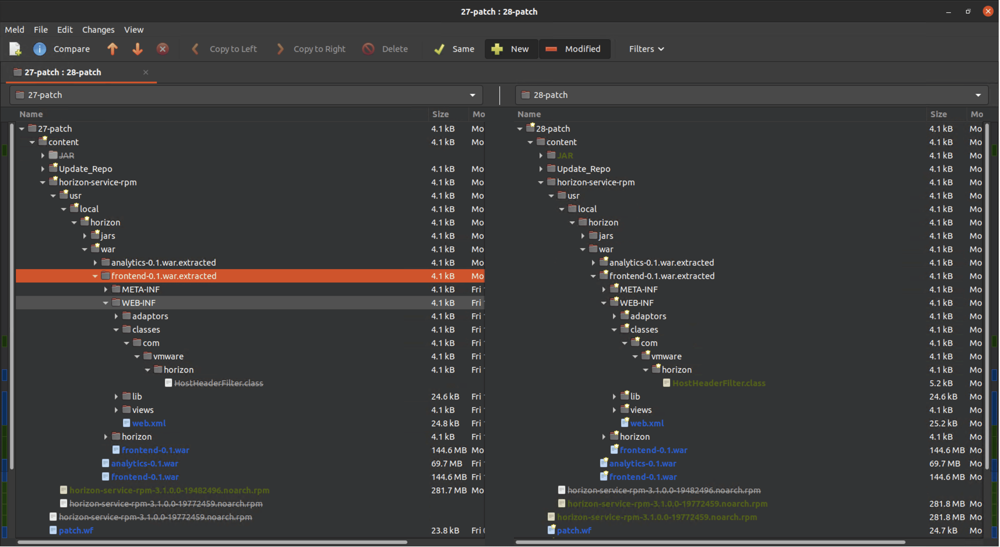
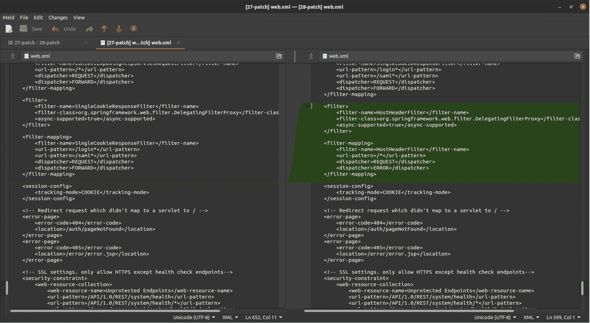
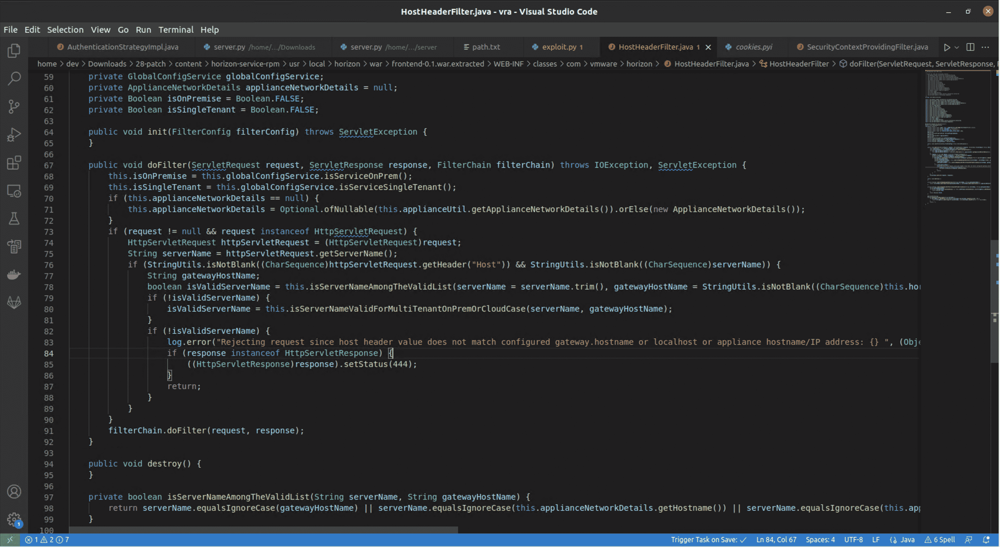
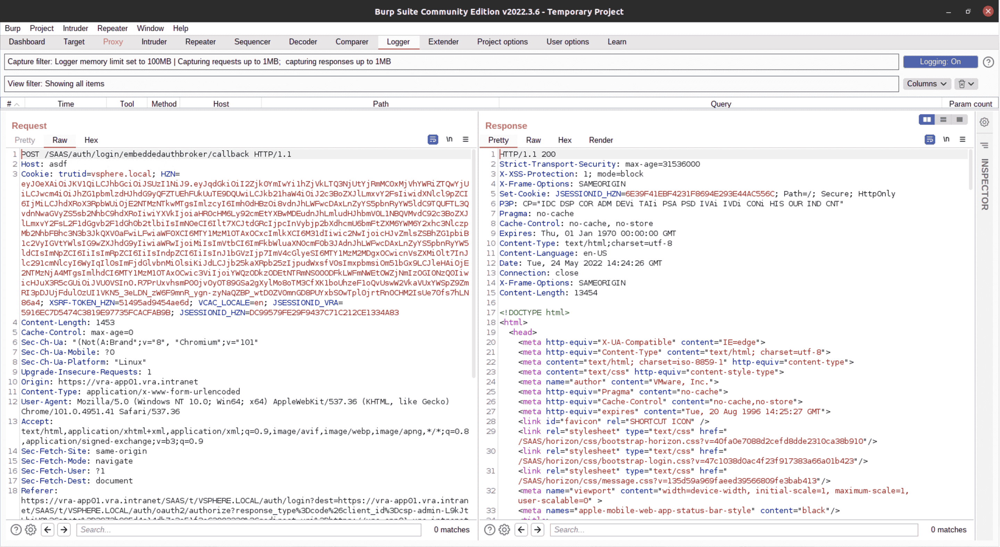
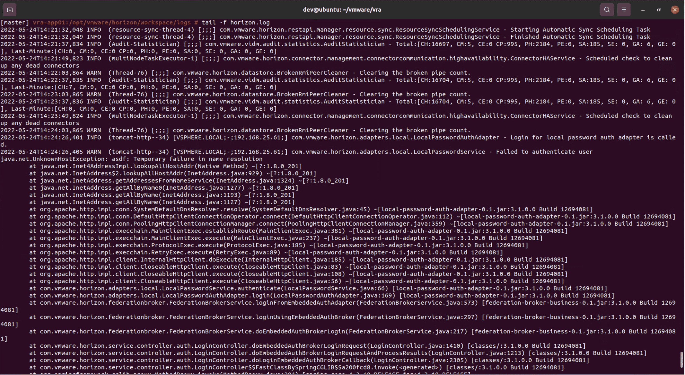
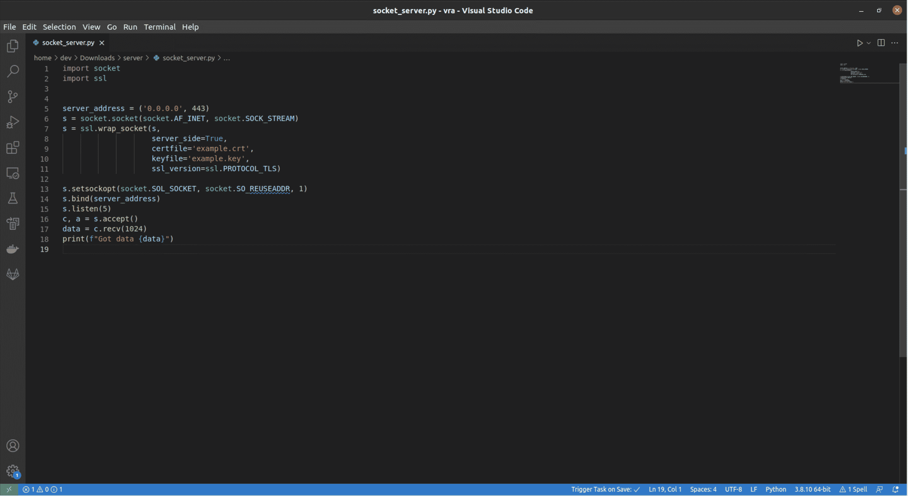
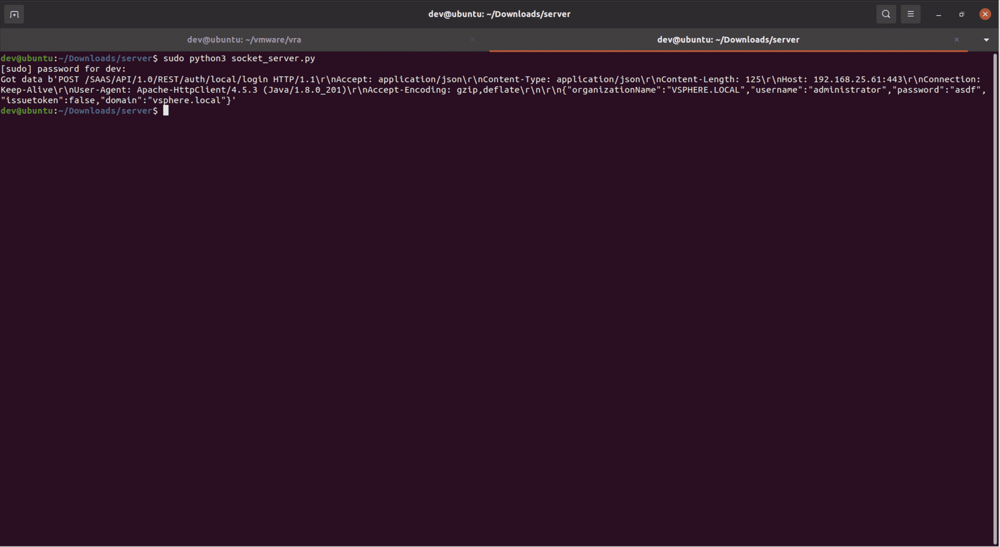
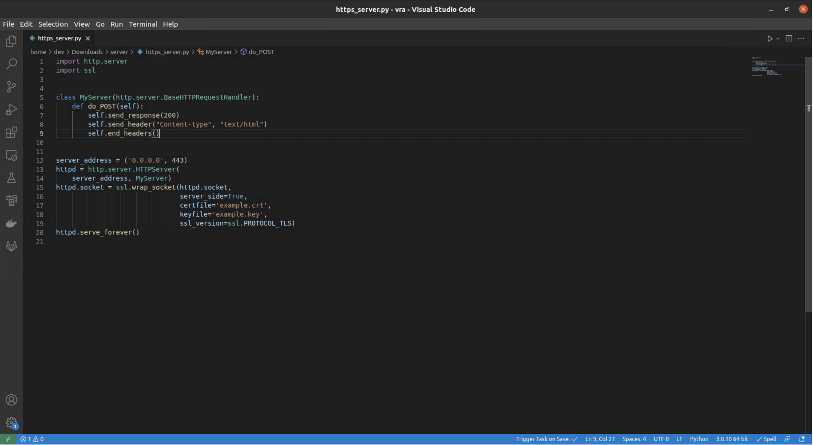

# CVE-2022-22972
Sau khi công bố lỗ hổng `CVE-2022-22972`, VMware nhanh chóng  phát hành bản vá 28 để khắc phục. Vậy để biết được nguyên nhân gây ra lỗ hổng này ta sẽ tiến hành so sánh bản vá 27 trước đó với bản vá 28 để tìm xem VMware đã thay đổi những gì để vá lỗ hổng này.

Sau khi giải nén trích xuất nội dung ta thấy có 3 điểm khác biệt trong `dbConnection-0.1-jar-with-dependencies.jar, analytics-0.1.war và frontend-01.war`. 

Trích xuất nội dung các tệp `.war` :



Đáng chú ý, ta thấy một file mới `HostHeaderFilter.class` được thêm vào và một số điểm thay đổi trong file `web.xml` ( thẻ `HostHeaderFilter` được thêm vào) :



Sử dụng Java decompiler để  convert `HostHeaderFilter.class`  thành `HostHeaderFilter.java` :



Có vẻ nó đang từ chối bất kỳ yêu cầu nào đó có `Host header` được coi là không hợp lệ. 
Dựa vào điều này ta sẽ thử gửi yêu cầu đến máy chủ đang tồn lại lỗ hổng một `Host header`  với giá trị `asdf` không hợp lệ xem sao.



Dường như không thấy có chuyện gì kì lạ xảy ra nhưng nhìn vào `horizon.log` trên thiết bị ta lại thấy nó đang cố gắng tạo kết nối với `Host header` mà ta vừa đưa vào.



Tạo một `HTTP server` và đưa nó vào `Host header`, ta thấy ứng dụng đang đợi phản hồi từ `HTTP server` rằng `user` này có được quyền truy cập hay không.





Quay lại đoạn log vừa nãy, ta quan sát các exception rằng có vẻ đoạn code xử lí `host header` nằm trong `local-password-auth-adapter-0.1.jar` 


Tiến hành giải nén và deconplied file `LocalPasswordAuthAdapter.login`

```java
/*    0 */   @Nonnull
/*    0 */   public AuthnAdapterResponse login(@Nonnull String tenantId, @Nonnull Map<String, String> config, @Nullable HttpServletRequest request, @Nullable HttpServletResponse response, @Nullable Map<String, String> inputParameters) throws AuthAdapterConfigException {
/*  140 */     AuthnAdapterResponse authnAdapterResponse = new AuthnAdapterResponse();
/*  142 */     log.info("Login for local password auth adapter is called.");
/*  143 */     Locale locale = (request == null) ? Locale.getDefault() : request.getLocale();
/*  145 */     this.messages.setLocale(locale);
/*  146 */     if (inputParameters == null)
/*  147 */       inputParameters = new HashMap<>(); 
/*  151 */     if (null == inputParameters.get("numAttempted")) {
/*  152 */       inputParameters.put("numAttempted", "0");
/*  153 */       return generateResponseForCollectingUserInputFirstTime(inputParameters, locale, authnAdapterResponse);
/*    0 */     } 
/*    0 */     try {
/*  157 */       assureRequiredUserInput(inputParameters, locale);
/*  158 */     } catch (AuthAdapterConfigException e) {
/*  159 */       authnAdapterResponse = generateInProgressResponse(inputParameters, locale, authnAdapterResponse);
/*  160 */       authnAdapterResponse.getConfigAttributes().add(createErrorAttribute("error.local.password.noUserInput", e.getMessage()));
/*  161 */       return authnAdapterResponse;
/*    0 */     } 
/*  164 */     String username = ((String)inputParameters.get("username")).trim();
/*  165 */     String password = inputParameters.get("password");
/*  166 */     String domain = inputParameters.get("domain");
/*  168 */     String endpoint = getLocalUrl(request); // sour
/*  169 */     String userAgent = request.getHeader("User-Agent");
/*  170 */     if (null != endpoint && getLocalPasswordService(config).authenticate(endpoint, tenantId, username, password, domain, userAgent).booleanValue()) {
/*  171 */       if (response != null)
/*  172 */         response.setStatus(200); 
/*  174 */       return generateSuccessResponse(username, domain);
/*    0 */     } 
/*  177 */     Integer numAttempted = Integer.valueOf(1 + getNumAttempted(inputParameters).intValue());
/*  179 */     Integer allowedNumAttempts = getNumAttemptsAllowed(config);
/*  180 */     inputParameters.put("numAttempted", numAttempted.toString());
/*  181 */     if (numAttempted.intValue() >= allowedNumAttempts.intValue())
/*  182 */       return generateErrorResponse(username, domain); 
/*  184 */     authnAdapterResponse = generateInProgressResponse(inputParameters, locale, authnAdapterResponse);
/*  185 */     ConfigAttribute errorAttribute = createErrorAttribute("error.local.password.authFailed", locale);
/*  186 */     authnAdapterResponse.getConfigAttributes().add(errorAttribute);
/*  187 */     return authnAdapterResponse;
/*    0 */   }
```

Quan sát vào đoạn code dòng `168`  , Ở đây `getLocalUrl` sẽ tạo một endpoint để xác thực người dùng.

Đi sâu vào hàm `getLocalUrl`:

```java
/*    0 */   private String getLocalUrl(HttpServletRequest request) {
/*  194 */     if (null == request)
/*  195 */       return null; 
/*    0 */     try {
/*  200 */       return (new URL(SSLConst.HTTPS, request.getServerName(), request.getServerPort(), request.getContextPath() + "/API/1.0/REST/auth/local/login")).toString();
/*  201 */     } catch (MalformedURLException e) {
/*  202 */       log.error("Failed to create URL: " + e.getMessage(), e);
/*  203 */       return null;
/*    0 */     } 
/*    0 */   }
```

 - `getServerName()` code:

```java
    /**
     * Returns the host name of the server to which the request was sent.
     * It is the value of the part before ":" in the <code>Host</code>
     * header value, if any, or the resolved server name, or the server IP
     * address.
     *
     * @return a <code>String</code> containing the name of the server
     */
    public String getServerName();
```

 Đây chính là địa chỉ mà ứng dụng  gửi request tới `host` độc hại mà ta đang kiểm soát.

Quay lại dòng code `170` , lần cuối `host`  đại học của ta được gọi đến. 

- `getLocalPasswordService(config)` code :

```java
    @VisibleForTesting
    protected LocalPasswordService getLocalPasswordService(@Nullable final Map<String, String> config) {
        return new LocalPasswordService();
    }
```

Do ta có thể thao túng được `host header`  nên giá trị endpoint độc hại sẽ được chuyển tiếp tới `LocalPasswordService.authenticate`.

- `LocalPasswordService.authenticate` code:

```java
/*    0 */   public Boolean authenticate(@Nonnull String endpoint, @Nonnull String tenantId, @Nonnull String username, @Nonnull String password, @Nullable String domain, @Nonnull String userAgent) {
/*   63 */     if (StringUtils.isBlank(username) || StringUtils.isBlank(password)) {
/*   64 */       LOGGER.info("No username or password provided, authentication fails.");
/*   65 */       return Boolean.valueOf(false);
/*    0 */     } 
/*   67 */     LOGGER.debug("Attempting to authenticate user " + username + " via " + endpoint);
/*    0 */     try {
/*   73 */       RequestBuilder requestBuilder = RequestBuilder.create("POST").setUri(endpoint).addHeader("Accept", "application/json").addHeader("Content-Type", "application/json").addHeader("User-Agent", userAgent);
/*   75 */       requestBuilder.setEntity(new StringEntity((new ObjectMapper()).writeValueAsString(new LoginRequest(tenantId, username, password, domain)), Const.utf8Charset));
/*   77 */       this.idmXRay.beginHttpSubsegment("SAAS", endpoint, "POST", Optional.of(requestBuilder));
/*   80 */       HttpResponse httpResponse = this.httpClient.execute(requestBuilder.build());
/*   81 */       EntityUtils.consumeQuietly(httpResponse.getEntity());
/*   83 */       int responseCode = httpResponse.getStatusLine().getStatusCode();
/*   84 */       if (200 == responseCode) {
/*   85 */         LOGGER.debug("Successfully authenticated user " + username);
/*   86 */         return Boolean.valueOf(true);
/*    0 */       } 
/*   88 */       LOGGER.debug("Failed to authenticate user " + username + ", status code " + responseCode);
/*   90 */     } catch (IOException e) {
/*   91 */       LOGGER.warn("Failed to authenticate user ", e);
/*   92 */       this.idmXRay.addException(e);
/*    0 */     } finally {
/*   94 */       this.idmXRay.endSubsegment();
/*    0 */     } 
/*   96 */     return Boolean.valueOf(false);
/*    0 */   }
```

Request sẽ bắt đầu được thi thực tới `host` độc hại mà ta đang kiểm soát ở dòng `80` và `response` sau đó được so sánh với 200. Nếu `response`  trả lại `200` thì user sẽ được  `authenticated`.

Ta sẽ sửa lại máy chủ của mình để nó sẽ phản hồi với trạng thái `200` cho mất kì yêu cầu nào gửi tới.



Vậy là chúng ta đã có thể đăng nhập được thành công.


### Tool
- Shodan search: `"http.favicon.hash: -1250474341" `
- Scan: `nuclei  -u [ url ]  -t cves/2022/CVE-2022-22972.yaml  -timeout 15 ` 
- POC: https://github.com/horizon3ai/CVE-2022-22972

